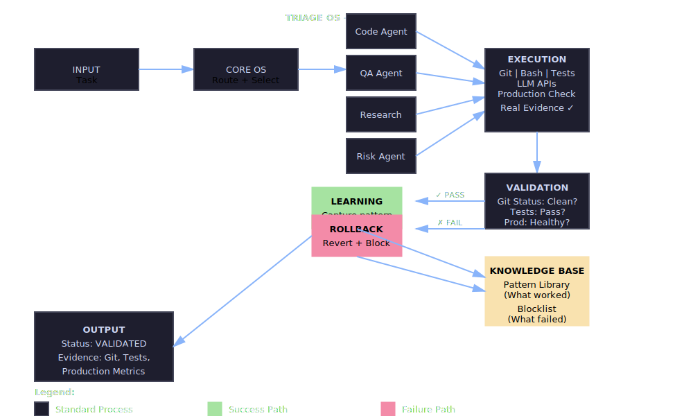
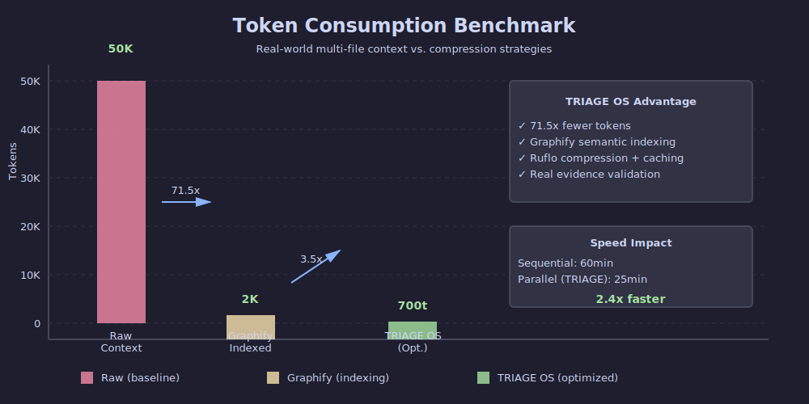

# TRIAGE OS — Validation-First Agent Orchestration

> **The medical triage system for AI agents that validate against real evidence.**


## Quick Start

```bash
# 1. Clone & install
git clone https://github.com/fsosnik/triage.git
cd triage && npm install

# 2. Configure
cp .env.example .env
# Add ANTHROPIC_API_KEY

# 3. Run
npm start
open http://localhost:3001
```

📖 **Full docs**: [docs/guides/QUICKSTART.md](docs/guides/QUICKSTART.md)

---

## What is TRIAGE OS?

Most AI agent systems **hallucinate success**. TRIAGE OS routes tasks to 4 specialist agents in parallel, executes them against **real tools** (Git, Bash, tests, APIs), validates **against actual evidence**, and learns automatically.



---

## System Architecture (7 Layers)

- **Layer 7**: Knowledge Base (Pattern Library + Blocklist)
- **Layer 6**: Checkpoint (Git + audit trail)
- **Layer 5**: Validation Gate (Real evidence only)
- **Layer 4**: Execution Tools (Git, Bash, Tests, LLM APIs)
- **Layer 3**: Agent Mesh (Code, QA, Research, Risk)
- **Layer 2**: Core OS (Orchestrator)
- **Layer 1**: Input (Task + constraints)

📚 [Full Architecture](docs/architecture/ARCHITECTURE.md)

---

## Benchmarks



- **71.5x fewer tokens** (Graphify indexing)
- **2.4x faster** (parallel agents)
- **0% hallucination** (evidence-based)

---

## Status

| Component | Status | Note |
|-----------|--------|------|
| Architecture | ✅ 7/10 | Proven design |
| Implementation | 🟡 4/10 | Core real, agents partial |
| Security | 🟡 5/10 | Bcrypt in progress |
| Production | ❌ 0/10 | Prototype stage |

**Current Use**: Learning & experimentation only.

---

## Documentation

- 📖 [Quick Start](docs/guides/QUICKSTART.md)
- 🏗️ [Architecture](docs/architecture/ARCHITECTURE.md)
- 🔧 [Installation](docs/guides/INSTALLATION.md)
- 📊 [API Reference](docs/api/API_REFERENCE.md)
- 🤖 [Agents Guide](docs/guides/AGENTS.md)

---

## Honesty Statement

✅ **What's real:**
- 4-agent orchestration (working)
- Evidence validation (Git, tests, production)
- Learning loops (patterns captured)

❌ **What's not:**
- Production-ready (still prototype)
- All agents fully real (some mocks)

**Rule**: If code contradicts docs, code wins.

---

## Contributing

1. Read [CONTRIBUTING.md](CONTRIBUTING.md)
2. `npm test` must pass
3. Update docs if architecture changes
4. Be honest about what works

---

Made by: **Bridger4u** | GitHub: [@fsosnik](https://github.com/fsosnik)

